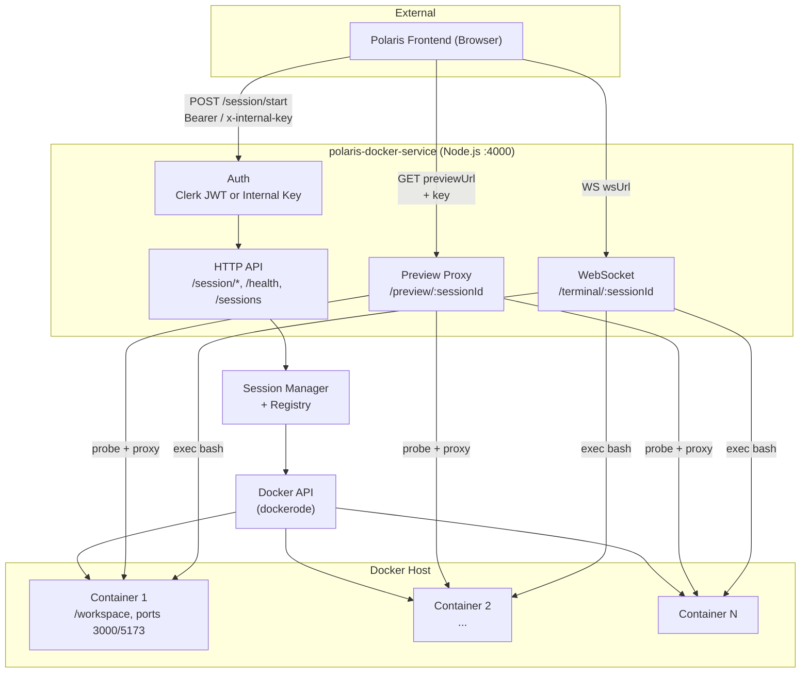
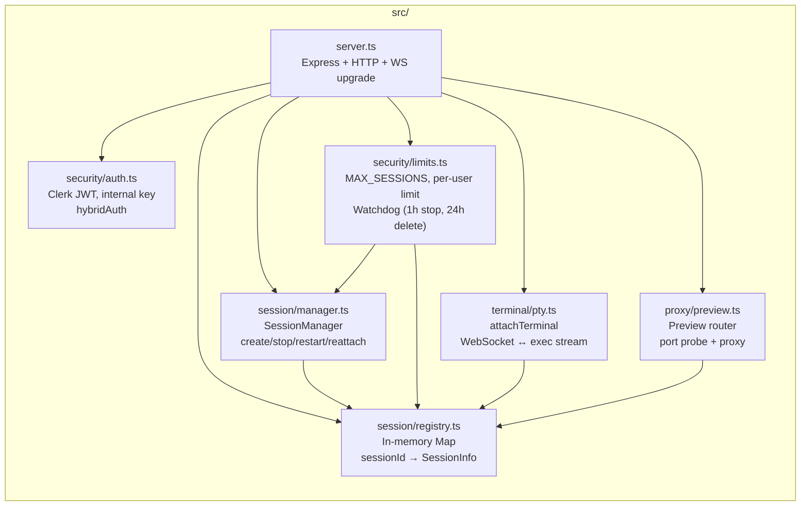
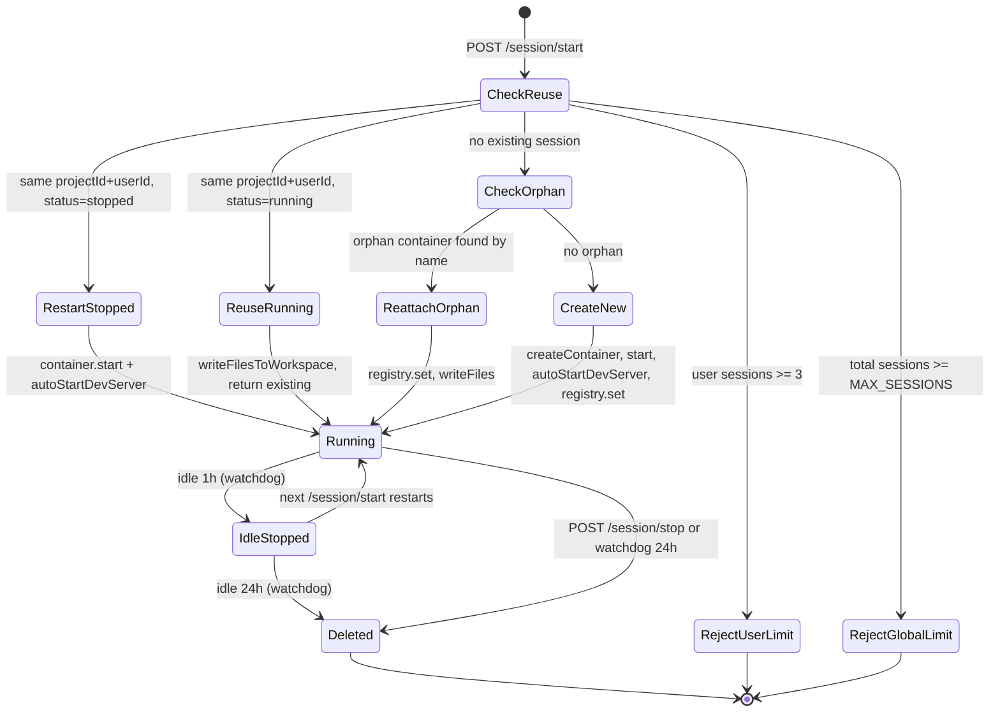
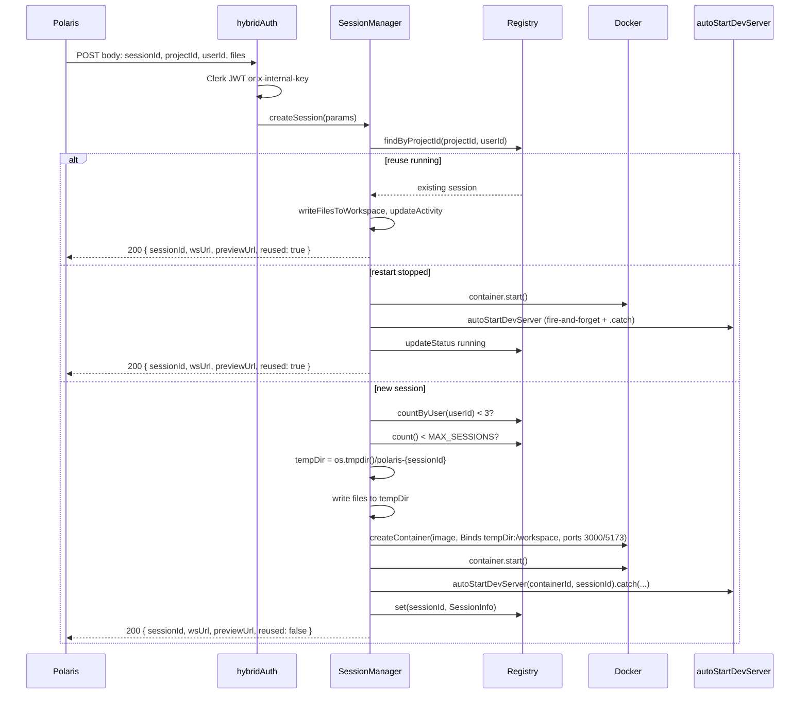
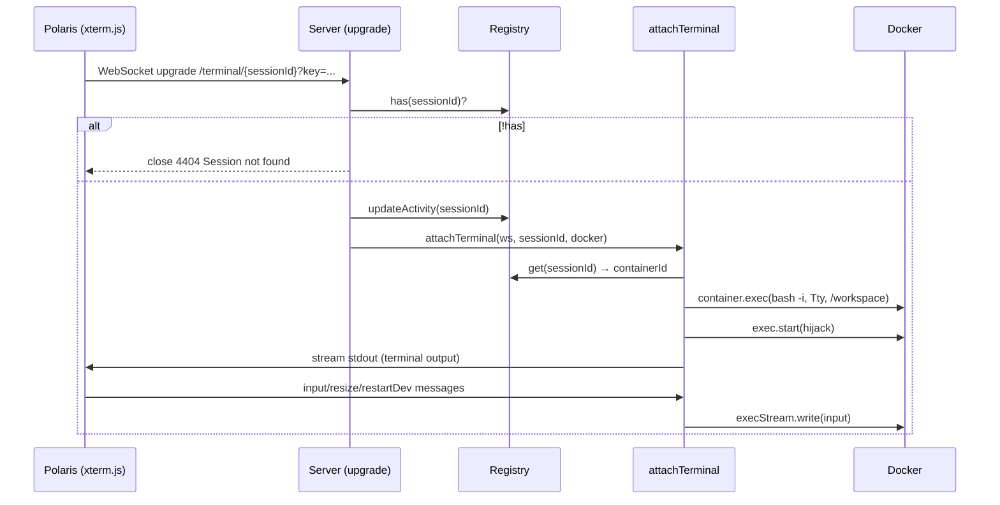
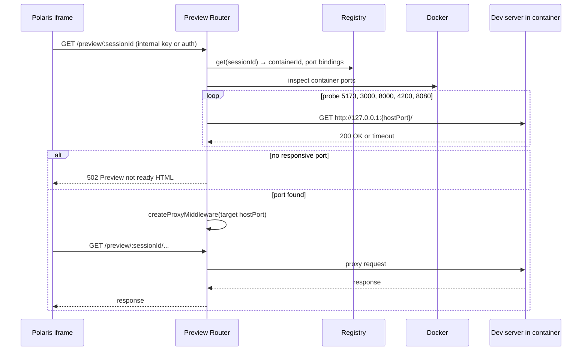
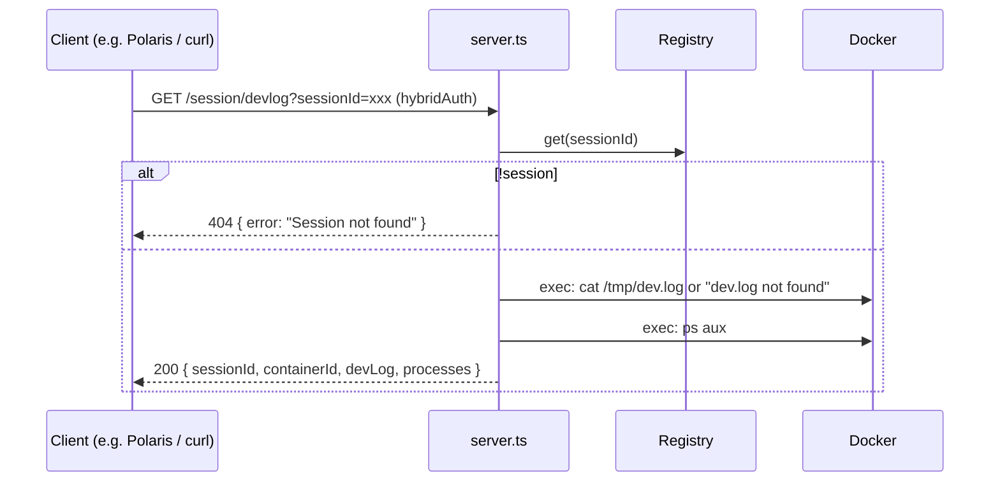
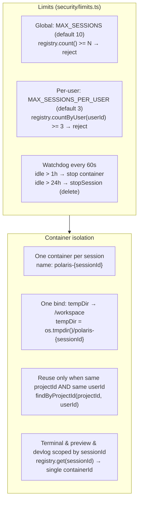
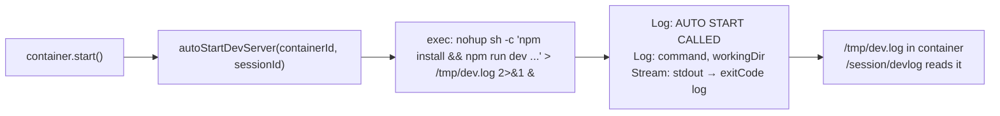

# Polaris Docker Service — System Design

High-level and detailed view of the current architecture.

---

## 1. High-level architecture



---

## 2. Main components



---

## 3. Session lifecycle



---

## 4. Request flows

### 4.1 Start session (POST /session/start)



### 4.2 Terminal (WebSocket /terminal/:sessionId)



### 4.3 Preview (GET /preview/:sessionId)



### 4.4 Debug (GET /session/devlog?sessionId=)



---

## 5. Limits and isolation



| Mechanism | Purpose |
|-----------|--------|
| **MAX_SESSIONS** | Global cap so the host doesn’t run too many containers. |
| **MAX_SESSIONS_PER_USER** | Per-user cap (3); no user can hold more than 3 sessions. |
| **Watchdog** | Idle 1h → container stopped (session kept); idle 24h → container + registry entry removed. |
| **SessionInfo.userId** | Reuse and count are per user; no cross-user reuse. |
| **Isolated tempDir + single bind** | Each session has its own `/workspace`; no sharing of user code between sessions. |

---

## 6. Auto-start dev server



- **When:** After `container.start()` for new sessions and on `restartSession`.
- **Command:** Configurable via `POLARIS_DEV_COMMAND`; default `npm run dev -- --host 0.0.0.0 --port 5173`.
- **Output:** Piped to `/tmp/dev.log` in the container for debugging via `/session/devlog`.

---

## 7. File layout (reference)

```
src/
├── server.ts           # Express, HTTP, WS upgrade, routes
├── session/
│   ├── manager.ts      # SessionManager, autoStartDevServer, Docker create/start/stop
│   └── registry.ts     # In-memory sessionId → SessionInfo, countByUser, findByProjectId
├── terminal/
│   └── pty.ts          # attachTerminal: WebSocket ↔ Docker exec (bash)
├── proxy/
│   └── preview.ts      # GET /preview/:id → probe port → proxy to container
└── security/
    ├── auth.ts         # Clerk JWT, internal key, hybridAuth
    └── limits.ts       # MAX_SESSIONS, watchdog (1h stop, 24h delete)
```

---

## 8. Environment / config

| Env / constant | Default | Meaning |
|---------------|--------|--------|
| `PORT` | 4000 | HTTP server port. |
| `MAX_SESSIONS` | 10 | Global max concurrent sessions. |
| `MAX_SESSIONS_PER_USER` | 3 | Max concurrent sessions per user. |
| `SANDBOX_IMAGE` | mdkulkanri20/polaris-sandbox:latest | Container image. |
| `POLARIS_DEV_COMMAND` | `npm run dev -- --host 0.0.0.0 --port 5173` | Dev command in container. |
| `IDLE_STOP_MS` | 1h | Idle before container is stopped. |
| `IDLE_DELETE_MS` | 24h | Idle before session is fully deleted. |
| `WATCHDOG_INTERVAL_MS` | 60_000 | How often watchdog runs (1 min). |

---

*Generated for polaris-docker-service. View in an editor that supports Mermaid (e.g. VS Code with Mermaid extension, or [mermaid.live](https://mermaid.live)).*
